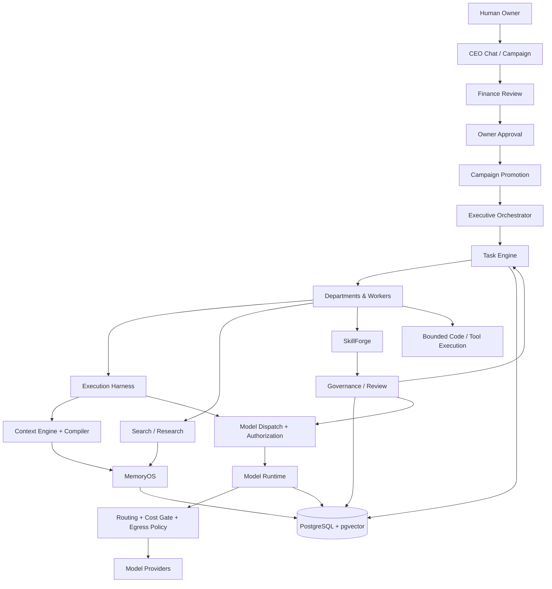

# Explorarte Organization Kernel

A governed multi-agent organizational control plane written in Go. Explorarte turns a human mission into a durable, auditable execution graph in which planning, finance, authorization, model access, memory, research, tools, and execution are separated by explicit trust boundaries.

## Organization Architecture

### How the organization works

| Layer | Responsibility |
| --- | --- |
| **Human Owner** | Defines missions and retains final authority over governed execution. Owner approval freezes the authorized campaign state and execution budget. |
| **CEO Chat** | Natural-language control surface. Interprets the owner's request, uses bounded host-owned tools, and creates or revises campaign proposals without bypassing authorization. |
| **Campaign** | Durable lifecycle for proposal → financial review → owner approval → promotion. Canonical hashes and idempotency keys bind every transition to the exact approved state. |
| **Finance** | Reviews campaign scope and produces a recommended execution budget. The recommendation is validated by host code before it can become an owner-approved execution ceiling. |
| **Executive Orchestrator** | Converts an approved campaign into an executable root and decomposes it into governed organizational work across planning, implementation, review, and closure phases. |
| **Task Engine** | Durable coordination substrate: tasks, attempts, leases, dependencies, lineage, retries, idempotency, state transitions, and recovery after crashes. |
| **Departments & Workers** | Specialized organizational roles that execute bounded tasks. They receive only the authority, context, tools, and budget granted to that task. |
| **Execution Harness** | Runs bounded agent/model turns under a durable run descriptor, tool limits, context identity, lineage, and replay-safe execution semantics. |
| **Context Engine / Compiler** | Builds the provider-visible context from trusted and untrusted sources, persists snapshots, validates provenance, and binds execution to exact context bytes/digests. |
| **Model Dispatch & Authorization** | Resolves execution principals and dispatcher assignments, validates task lineage and capabilities, and fails closed before a model invocation can be authorized. |
| **Model Runtime** | Resolves routes, applies cost and egress controls, invokes provider adapters, and persists invocation/accounting records. |
| **Search / Research** | Retrieves external evidence through policy-controlled search providers, preserves provenance, deduplicates sources, and can produce governed RAG candidates rather than directly promoting knowledge. |
| **MemoryOS** | Separates working context, episodic experience, and consolidated semantic knowledge. Memory promotion is governed rather than an unrestricted write path. |
| **SkillForge** | Lifecycle for candidate agent skills: draft/import, evaluation, governance, and activation. Unapproved skills do not become production capabilities. |
| **Code / Tool Execution** | Executes explicitly bounded host tools or code operations under capability and mission constraints; it is not an unrestricted shell available to agents. |
| **Governance & Audit** | Capability policy, canonical configuration, approvals, evidence, immutable history, cost controls, health checks, and fail-closed safety boundaries. |
| **PostgreSQL + pgvector** | Durable source of truth for organizational state, tasks, lineage, approvals, runs, model records, memory, provenance, and vector-backed retrieval. |

### End-to-end mission flow

1. The **owner** gives the CEO a mission in natural language.
2. **CEO Chat** turns it into a durable campaign proposal.
3. **Finance** reviews the proposal and recommends an execution budget.
4. The **owner** approves the exact proposal/review/budget tuple.
5. **Campaign Promotion** creates the governed Executive root while preserving replay-safe identity and trusted causation.
6. The **Executive Orchestrator** decomposes the mission into departmental tasks.
7. The **Task Engine** coordinates attempts, leases, dependencies, retries, and crash recovery.
8. Workers execute through the **Execution Harness**, which obtains exact context from the **Context Engine** and model authority from **Model Dispatch**.
9. **Model Runtime**, search, memory, skills, and bounded tools are accessed only through their respective policy and governance boundaries.
10. Results, evidence, costs, and state transitions are persisted for review, closure, recovery, and later governed learning.

### Core design principle

The system deliberately separates **reasoning from authority**. A model may propose, analyze, or recommend, but host-owned services decide what it may read, spend, invoke, mutate, promote, or execute. Durable identities, canonical hashes, leases, budgets, provenance, and authorization boundaries make the organization replayable and auditable.
